<h1 align="center"></h1>

<p align="center">
  <strong>A terminal dashboard for agents, configured commands, workspaces, and groups.</strong>
</p>

<p align="center">
  
  
  
</p>

Weft helps you manage parallel work in one terminal. Run agent sessions and
project commands, organize them by workspace and group, see which tasks need
attention, and jump back into the right console when you need it.

## Demo

Demo video coming soon.

## Why Weft

- See every agent or command task in one dashboard instead of hunting through
  terminal tabs.
- Organize tasks into optional groups inside each workspace, such as `release`,
  `review`, `bugs`, or `experiments`.
- Track workspace totals for `active` and `needs attention` tasks so finished
  or blocked work does not sit idle.
- Auto-name agent tasks from their first message, or configured command tasks
  from their first command, with an optional title hook.
- Detach, upgrade, or reopen the UI while local work keeps running.
- Focus one task for direct input, then return to the dashboard to switch or
  reorganize.
- Use the mouse inside a task: scroll history and drag-copy bounded text.

## Getting Started

```sh
brew install edwmurph/tap/weft
weft
```

In the dashboard:

- Press `n` to create a task.
- Choose `Codex` for an agent task, or `Shell` for a configured command task.
- Press `Enter` to open the selected task.
- Press `C-b` to return to the dashboard.
- Press `?` for shortcuts.

## Supported Agents

Weft supports Codex today.

Additional agents can be added upon request. Config can also define generic
shell command tasks, which are useful for tests, dev servers, logs, scripts, or
any other command you want to keep visible beside agent work.

## Learn More

- [Usage](docs/usage.md): dashboard controls, common commands, upgrades, and key diagnostics.
- [Configuration](docs/configuration.md): task types, configured commands, title templates, and title hooks.
- [Technical Notes](docs/technical.md): how Weft works under the hood.
- [Product Specification](spec.md): the living design contract for Weft.
- [Contributing](CONTRIBUTING.md): local checks and release workflow.

## License

MIT
