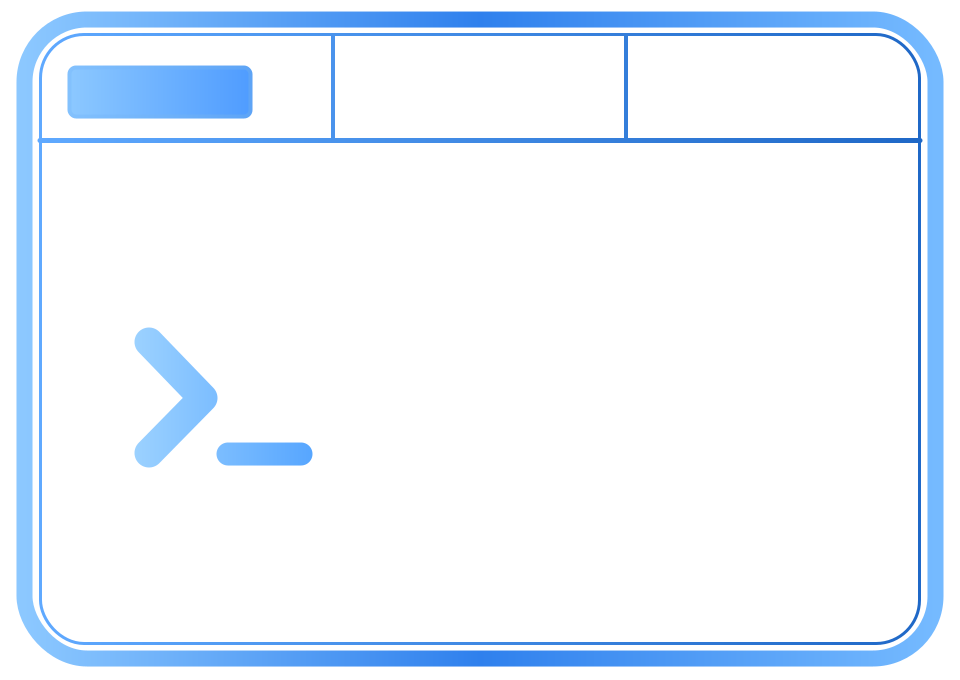

<h1 align="center"> Codux</h1>

<p align="center">
  <strong>Coordinate multiple Codex sessions from a single tmux workspace.</strong>
</p>

<p align="center">
  
  
  
  
</p>

<table align="center">
  <tr>
    <td width="680" align="center">
      Codux manages parallel Codex workflows inside tmux using a lightweight kanban-style workspace. It keeps agent sessions organized as you scale to multiple threads.
    </td>
  </tr>
</table>

## Why Codux

- **One tmux workspace, many Codex threads.** Keep related agents organized without leaving the terminal.
- **Kanban-style workflow state.** Move sessions through customizable columns as work progresses.
- **Native Codex panes.** Codux coordinates tmux layout, state, and focus without proxying Codex IO.

## Getting Started

Install Codux with Homebrew:

```sh
brew install edwmurph/tap/codux
```

Then run Codux directly from the project directory you want to manage:

```sh
codux doctor
codux start
```

Optional shell completion:

```sh
codux --install-completion
```

Run the completion command from the shell you want to configure.

## Usage

Start Codux from the project directory whose Codex sessions you want to manage:

```sh
codux start
```

This launches a tmux workspace with a navigator pane above a native Codex pane.
Use the navigator to create, rename, close, focus, and move Codex sessions across
columns; press `?` inside Codux for the current shortcuts. Codux tracks live
Codex pane titles without proxying Codex input or output.

If tmux leaves the dashboard in a stale visual state, run `codux refresh` from
the same project directory to redraw the dashboard and focus the nav pane.

```text
Usage: codux [OPTIONS] COMMAND [ARGS]...

Start, inspect, or detach Codux tmux workspaces for Codex.

Codux is scoped to the directory where you run it. Each launch directory gets:
- a stable runtime directory under ~/.codux/workdirs/<workdir-id>
- config.toml and state.json files
- a tmux session

Starting again from the same directory reattaches to that workspace. Starting
from a different directory creates a separate one.

Use `codux config info` to see the active workdir, runtime directory, config
file, state file, and tmux session.

Options:
  --help          Show this message and exit.

Commands:
  start           Create or attach to this workdir's Codux tmux workspace.
  quit            Detach or stop the Codux dashboard.
  sessions        List active Codux dashboard sessions.
  delete-session  Delete a Codux dashboard session without confirmation.
  clear           Delete all Codux tmux sessions and saved workspaces after
                  confirmation.
  refresh         Redraw the Codux dashboard and focus the nav pane.
  doctor          Check local Codux dependencies and runtime files.
  config          Inspect or initialize the config.toml for the current Codux
                  workdir.
```

## Config And State

Codux scopes runtime state to the directory where it starts. The first
`codux start` for a directory creates one tmux session named
`codux-<workdir-id>`, plus `config.toml` and `state.json` under
`~/.codux/workdirs/<workdir-id>/`. Starting from that directory again reattaches
to the same workspace; starting from another directory creates a separate one.

Use `codux config info`, `codux config path`, `codux config show`, and
`codux config init` to inspect or initialize the current directory's runtime.

The default config:

```toml
# Codux runtime configuration for one launch directory.
# Run `codux config info` to see the workdir, runtime directory, state file, and
# generated tmux session. Set tmux_session only when you need to override it.

# Command launched directly inside each CODEX tmux pane.
codex_command = "codex"

# Ordered columns shown in the nav pane.
columns = ["inbox", "implement", "ship"]

[key_bindings]
new = "n"
prev = "Left"
next = "Right"
move_left = "S-Left"
move_right = "S-Right"
rename = "r"
close = "c"
sessions = "s"
help = "?"
focus_toggle = "C-d"
quit = "C-q"
```

Set `columns` to change the nav columns and their order. Existing tabs in
removed columns are moved to the first configured column the next time Codux
repairs runtime state.

Codux computes the default tmux session name from the launch directory. Set
`tmux_session` only when you need an explicit override.

`CODUX_WORKDIR` overrides the directory used for workdir scoping. `CODUX_HOME`
overrides the runtime directory directly; use it only when you intentionally
need isolated state for development or tests.

State writes are atomic and guarded by `state.lock` so rapid tmux keybindings do
not corrupt the JSON file.
